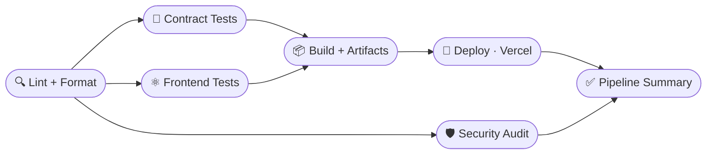

# Polaris — Decentralized Prediction Markets on Stellar

**Polaris** — **P**rediction **O**dds & **L**iquidity for **A**sset, **R**esult & **I**nformation **S**ettlement

A fully on-chain prediction market protocol built on Stellar using Soroban smart contracts. Trade YES/NO outcome tokens on crypto price predictions with AMM-powered pricing, multi-signer oracle resolution, and LP incentives.

---

**Demo Video :** https://youtu.be/S6CzRxhlE1s?si=c6L7nMtUnAqa4d-5

**Live Link :** https://polaris-stellar.vercel.app

---

## What Is This?

Polaris is a Polymarket-style prediction market, but natively built for Stellar:

- **Markets:** "Will BTC exceed $100k by Dec 31, 2026?" → YES/NO tokens
- **AMM:** Fixed-product (x*y=k) pricing over a USDC-collateralized complete-set model, always-available liquidity
- **Oracle:** Multi-signer committee (3-of-5) resolves outcomes; a dispute window protects against manipulation
- **Settlement:** Winning token holders redeem 1:1 for USDC, losers burn to zero
- **LPs:** Provide USDC liquidity, earn 80% of the 0.30% trading fee (20% to treasury)

## Features

- Constant-product AMM with USDC on/off ramp (`buy` / `sell` complete sets)
- Per-market contract isolation deployed via a Factory that initializes all child contracts atomically
- Multi-signer threshold oracle with on-chain dispute window
- Real-time UI: WebSocket event stream with auto-reconnect + replay cursor
- Mobile-responsive trading terminal, portfolio, and liquidity dashboards
- Professional loading skeletons, spinners, and transaction status modals
- Typed SDK (`@stellarpm/sdk`) with ScVal codecs and tx simulation/submission
- PostgreSQL event indexer with on-chain reconciliation and price-history capture

---

## Live Testnet Deployment

Deployed and verified on **Stellar Testnet** (Soroban). View any address on [stellar.expert testnet explorer](https://stellar.expert/explorer/testnet).

| Contract | Address |
|----------|---------|
| **MarketFactory** | `CDE3CXXJCHNLRIQCAQJ6R6FPC5YA5VDOMO2PDYMK66F6XTTJROX76UNI` |
| **Oracle** | `CAFP5Y2E75IEQSZ5DOKPJCKLQCUZXXAGY2DV3Q4PUXNTVNFPQ3HNDG2F` |
| **Settlement** | `CBVJYJ3U7VFS5UMMCSHRLQZ3WUOOHDEMAIIBXOQD4YM3FSML4EGFEOK5` |
| **Treasury** | `CCATFS3BGLECQKZ7JGIFLKDIMVZW27ZSLLNO3DRT5GB2M4BXR7AVKMPA` |
| **USDC (Circle testnet SAC)** | `CBIELTK6YBZJU5UP2WWQEUCYKLPU6AUNZ2BQ4WWFEIE3USCIHMXQDAMA` |
| **Deployer** | `GCKVK36XWVWUPWCBTA3S5L4ISVCV3RIRUNZRDPGO2CM6QL7LUPMNGBMN` |

### Verified Transaction Hashes (contract interactions)

| Tx Hash | Operation | Ledger |
|---------|-----------|--------|
| `9a57ccbe6babfc42f98431620b34cfe1b858db32989980909d5c3853563fc9be` | `create_market` | 2897266 |
| `6ca4eedbaf0452a904308e4497c2b9f6f48b7671565766fa71647bf0e8dbae08` | `initialize` (child) | 2897260 |

Explorer: `https://stellar.expert/explorer/testnet/tx/9a57ccbe6babfc42f98431620b34cfe1b858db32989980909d5c3853563fc9be`

---

## Architecture

```
MarketFactory ──deploys+initializes──► Market ◄──routes──► AMM
                                          │
                                          ├──mints──► YES Token
                                          ├──mints──► NO Token
                                          └──mints──► LP Token

Oracle ──record_resolution──► Settlement ──pays──► Winners
                                  │
                                  └──fee──► Treasury
```

- **Pricing:** USDC collateral; 1 USDC ⇄ 1 YES + 1 NO ("complete set"). `buy` mints a set into the pool and runs the CPMM curve; `sell` redeems a set back to USDC.
- **Settlement:** `payout_per_token = (total_pool − protocol_fee) / winning_supply`
- **Isolation:** Each market is its own contract — a bug in one cannot drain another's liquidity.

Full design in [ARCHITECTURE.md](./docs/ARCHITECTURE.md); contract reference in [CONTRACTS.md](./docs/CONTRACTS.md).

### Project Structure

```
protocol/        Soroban smart contracts (Rust): factory, market, amm,
                  oracle, settlement, token, treasury, shared
frontend/         Next.js 14 trading frontend (TypeScript)
packages/sdk/     Typed contract SDK (ScVal codecs, tx builders, clients)
packages/shared/  Shared TypeScript types
packages/db/      Prisma schema + pooled client (Neon Postgres)
backend/indexer/  Soroban event indexer → Postgres → WebSocket broadcaster
backend/api/      REST API over indexed data
backend/workers/  Oracle price-feed + resolution worker
scripts/deploy/   Deployment + seed + verify scripts
.github/workflows CI (ci.yml) and CD (deploy.yml)
```

---

## Tech Stack

| Layer | Technology |
|-------|-----------|
| Smart Contracts | Rust + Soroban SDK 21 |
| Frontend | Next.js 14 (App Router) + TypeScript + TailwindCSS + shadcn/ui + framer-motion |
| State | Zustand + TanStack Query |
| Wallet | Freighter + Stellar Wallets Kit |
| SDK | `@stellar/stellar-sdk` 12 |
| Indexer / API | Node.js + Prisma + PostgreSQL (Neon) + ws |
| Oracle | Node.js + CoinGecko / Binance / CMC feeds |
| Tests | `cargo test` (contracts) + Vitest + Testing Library (frontend) |
| CI/CD | GitHub Actions |

---

## Installation

Prerequisites: Node.js 20+, Rust stable + `wasm32-unknown-unknown` target, [`stellar-cli`](https://developers.stellar.org), and (optional) PostgreSQL.

```bash
# 1. Install JS dependencies (npm workspaces)
npm install

# 2. Configure environment
cp .env.example .env.local        # frontend / runtime config
# (deploy uses .env.testnet — see below)

# 3. Build smart contracts
npm run build:contracts           # = stellar contract build

# 4. Run contract tests
npm run test:contracts            # = cargo test

# 5. Run frontend tests
npm run test --workspace=frontend # = vitest run

# 6. Start the frontend (mock data works with zero backend)
npm run dev:web                   # http://localhost:3000
```

---

## Environment Variables

All public (browser-exposed) variables are prefixed `NEXT_PUBLIC_`. Secrets are **never** committed (`.gitignore` blocks `.env*` except `.env.example`).

| Variable | Scope | Description |
|----------|-------|-------------|
| `NEXT_PUBLIC_STELLAR_NETWORK` | web | `testnet` \| `mainnet` \| `localhost` |
| `NEXT_PUBLIC_SOROBAN_RPC_URL` | web | Soroban RPC endpoint |
| `NEXT_PUBLIC_HORIZON_URL` | web | Horizon endpoint |
| `NEXT_PUBLIC_FACTORY_CONTRACT_ID` | web | MarketFactory address |
| `NEXT_PUBLIC_USDC_CONTRACT_ID` | web | Collateral token address |
| `NEXT_PUBLIC_API_URL` | web | REST API base URL |
| `NEXT_PUBLIC_WS_URL` | web | Indexer WebSocket URL |
| `DEPLOYER_SECRET_KEY` | deploy | Stellar secret (`S...`) — **secret** |
| `USDC_CONTRACT_ID` | deploy | Collateral token for new markets |
| `STELLAR_NETWORK` | deploy/backend | Target network |
| `DATABASE_URL` | backend | Pooled Postgres URL (runtime) — **secret** |
| `DIRECT_URL` | backend | Direct Postgres URL (migrations only) — **secret** |

See [.env.example](./.env.example) for the full template.

---

## Smart Contract Deployment

Deployment order (enforced by the script): **Treasury → Oracle → Settlement → upload child WASMs → MarketFactory → markets**.

```bash
# Populate .env.testnet with DEPLOYER_SECRET_KEY + USDC_CONTRACT_ID, then:
npm run deploy:testnet            # scripts/deploy/deploy-testnet.sh
```

The script auto-funds the deployer via friendbot, uploads all child WASMs, deploys the core contracts, and writes resolved addresses to `.env.deployed` and `deployments/testnet.json`. Verify with:

```bash
bash scripts/verify-deployment.sh # reads live state from every deployed contract
```

Detailed guide: [DEPLOYMENT.md](./docs/DEPLOYMENT.md) · [TESTNET_SETUP.md](./docs/TESTNET_SETUP.md).

---

## Event Streaming Architecture

Real-time updates flow **chain → indexer → WebSocket → UI** with no polling lag:

1. **Contracts emit events** — the AMM emits `buy` / `sell` with `(side, usdc, tokens, fee)`; the Factory emits `market_created`; Settlement emits `market_settled` / `market_resolved`.
2. **Indexer** (`backend/indexer`) polls Soroban RPC `getEvents` for all watched contract addresses (core + every market's AMM, discovered from the DB at startup and refreshed on `market_created`). Each event is parsed from XDR, written idempotently (`events.eventId`), and **reconciled**: the indexer reads `get_pool_state` from the AMM and updates `yesPrice/noPrice/tvl` plus appends a `price_history` row.
3. **Broadcaster** persists every payload to `broadcast_events` with a monotonic sequence and pushes it over WebSocket. Payloads are enriched with `marketId`, `ammContract`, `txHash`, and fresh reserves/prices.
4. **Frontend** (`frontend/hooks/use-realtime.ts`) subscribes per market, patches the Zustand store instantly, and invalidates the relevant TanStack queries. On reconnect it sends `{type:"replay", since:<seq>}` to backfill missed events.

**Reconnection & sync:** capped exponential backoff with jitter, a replay cursor for gap-free resync, and a mock-event fallback when no `WS_URL` is configured. See [INDEXER_SETUP.md](./docs/INDEXER_SETUP.md).

---

## Frontend Architecture

- **Next.js 14 App Router** — routes: `/`, `/markets`, `/markets/[id]` (trading terminal), `/markets/create`, `/portfolio`, `/liquidity`, `/governance`.
- **Data cascade** — `hooks/use-market.ts` resolves API → on-chain read → mock data so the UI works in every environment.
- **On-chain writes** — `hooks/use-trade.ts` builds single-tx `buy`/`sell` via the SDK, does a pre-flight balance check, maps reverts to human-readable errors, and returns the real tx hash.
- **State** — Zustand store for market/price/activity; TanStack Query for server/chain reads.
- **UX** — `transaction-modal.tsx` shows pending → confirming → success/error with an explorer link; `skeleton.tsx` drives loading states; a "Get Test USDC" faucet button appears when the wallet lacks collateral.
- **Security headers** — CSP, `X-Frame-Options`, `X-Content-Type-Options` set in `next.config.js`.

---

## Mobile responsive UI


## Testing

Two independent suites, both wired into CI.

### Smart contracts — `cargo test --all`

```
test result: ok. 5 passed   (amm)
test result: ok. 2 passed   (market)
test result: ok. 2 passed   (market-factory)
test result: ok. 2 passed   (oracle)
test result: ok. 2 passed   (settlement)
test result: ok. 3 passed   (shared)
test result: ok. 4 passed   (token)
test result: ok. 3 passed   (treasury)
──────────────────────────────────────
Total: 23 passed; 0 failed
```
## CI/CD Pipelines


### Frontend — `npm run test --workspace=frontend` (Vitest)

```
 ✓ lib/__tests__/utils.test.ts           (5 tests)
 ✓ components/ui/__tests__/badge.test.tsx (4 tests)
 ✓ components/ui/__tests__/button.test.tsx(4 tests)

 Test Files  3 passed (3)
      Tests  13 passed (13)
```

Coverage: `npm run test:coverage --workspace=frontend` (v8 reporter). Lint/format gates: `cargo fmt --all --check`, `cargo clippy --all-targets -- -D warnings`, `npm run lint`.

---

## CI/CD Pipeline

`.github/workflows/ci.yml` is a staged pipeline that runs on every push and PR to `main`/`develop`. Jobs are wired with `needs:` so GitHub renders the dependency graph as a flow of stages:



| Stage | What it does |
|-------|--------------|
| 🔍 **Lint & Format** | `cargo fmt --check` · `clippy -D warnings` · `tsc` type-check · `eslint` |
| 🦀 **Contract Tests** | `cargo test --all` (23 tests) |
| ⚛️ **Frontend Tests** | `vitest run` (13 tests) |
| 🛡️ **Security Audit** | `cargo audit` + `npm audit` (advisory, `continue-on-error`) |
| 📦 **Build & Artifacts** | release WASMs + `next build`, uploaded as workflow artifacts |
| 🚀 **Deploy (Vercel)** | production deploy on push to `main` (also via Vercel Git integration) |
| ✅ **Pipeline Summary** | renders the diagram + per-stage results into the run summary and **gates** the run |

The Summary stage fails the run if any required stage (lint, tests, build, deploy) fails. `.github/workflows/deploy.yml` is a separate manually-dispatched, environment-gated workflow for deploying the Soroban contracts with secrets from a GitHub Environment.

---

## Deployment Guide

| Target | Command | Notes |
|--------|---------|-------|
| Contracts (testnet) | `npm run deploy:testnet` | writes `.env.deployed` + `deployments/testnet.json` |
| Contracts (CI/CD) | `deploy.yml` → run workflow | secrets from GitHub Environment |
| Frontend | `npm run build --workspace=frontend` then Vercel/Node host | inject `NEXT_PUBLIC_*` at build |
| Verify | `bash scripts/verify-deployment.sh` | reads live state from all contracts |

**Rollback:** contracts are immutable per deploy — roll back by re-pointing `NEXT_PUBLIC_FACTORY_CONTRACT_ID` (and friends) to the previous known-good addresses in `deployments/` and redeploying the frontend. Each deploy is recorded with its WASM hashes in `deployments/testnet.json` for auditability.

---

## Troubleshooting

| Symptom | Cause / Fix |
|---------|-------------|
| `next lint` hangs | Ensure `frontend/.eslintrc.json` exists (non-interactive config). |
| WASM build fails on Rust ≥1.95 | Use `stellar contract build` (handles the `wasm32v1-none` target), not raw `cargo build`. |
| "Transaction Failed" on buy | Wallet has 0 test USDC — click **Get Test USDC**. `buy`/`sell` are single signed txs (no separate approve). |
| UI shows no styling | `frontend/postcss.config.js` must exist so Tailwind compiles. |
| Markets fall back to mock data | Factory address/env not set, or RPC unreachable — check `NEXT_PUBLIC_FACTORY_CONTRACT_ID`. |
| Realtime not updating | Indexer not running or `NEXT_PUBLIC_WS_URL` unset — see [INDEXER_SETUP.md](./docs/INDEXER_SETUP.md). |
| Prisma `migrate` fails | Use `DIRECT_URL` (non-pooled) for migrations; `DATABASE_URL` (pooled) for runtime. |

---

## Demo Walkthrough

1. **Browse markets** — open `/markets`; cards show live YES price, TVL, and 24h change.
2. **Open a market** — `/markets/[id]` is the trading terminal: price chart, order panel, live activity feed.
3. **Fund the wallet** — connect Freighter; if you hold no test USDC, click **Get Test USDC** (faucet mints 1000).
4. **Trade** — enter a USDC amount, pick YES/NO, review the quote (price impact + fee), confirm in Freighter; the transaction modal tracks pending → success and links the explorer.
5. **Watch it sync** — the price, chart, and activity feed update in real time via WebSocket as the indexer reconciles the on-chain pool.
6. **Provide liquidity** — `/liquidity`: deposit USDC, receive LP tokens, earn fees.
7. **Portfolio** — `/portfolio` reads your real on-chain YES/NO balances and computes P&L.

---

## Screenshots

> Add captures under `docs/screenshots/` and reference them here.

| View | File |
|------|------|
| Landing page | `docs/screenshots/landing.png` |
| Markets dashboard | `docs/screenshots/markets.png` |
| Trading terminal | `docs/screenshots/market-detail.png` |
| Portfolio | `docs/screenshots/portfolio.png` |
| Transaction modal | `docs/screenshots/tx-modal.png` |

---

## Security

This protocol has **not** undergone a third-party audit. Do not use with real funds on mainnet until a full audit is completed. See [SECURITY.md](./docs/SECURITY.md) for the threat model and [AUDIT_REPORT.md](./docs/AUDIT_REPORT.md) for the internal review.

## Protocol Decisions

- **Constant-product AMM over LMSR** — simpler, cheaper on-chain (no logarithms).
- **USDC base currency** — most liquid stable on Stellar; avoids LP volatility risk.
- **Per-market contracts** — complete isolation between markets.
- **Multi-signer oracle** — best available option until a mature on-chain oracle network exists on Stellar.

## License

MIT
